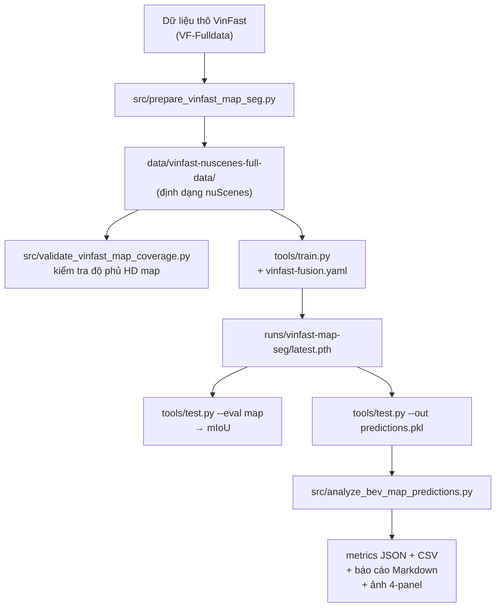

# ONBOARDING — Dự án Lane & Freespace Detection (VinFast × HCMUT)

Tài liệu dành cho người mới vào dự án. Mục tiêu: sau khi đọc hết bạn hiểu được
**bài toán là gì, dữ liệu đi từ đâu tới đâu, code nào của mình code nào của
thượng nguồn, và chạy cái gì để ra kết quả.**

File này bổ sung cho [README.md](README.md) — README là *các lệnh cần chạy*, file này là
*tại sao và như thế nào*.

---

## 0. Lộ trình đọc (đọc theo thứ tự này)

| Bước | Đọc gì | Thời gian |
|---|---|---|
| 1 | Mục 1–3 của file này (bài toán, tại sao phải convert, cây thư mục) | 20 phút |
| 2 | [README.md](README.md) — các lệnh chạy | 10 phút |
| 3 | Mục 4–5 (luồng dữ liệu, chi tiết converter) + mở song song [src/prepare_vinfast_map_seg.py](src/prepare_vinfast_map_seg.py) | 1–2 giờ |
| 4 | Mục 6 (nhãn đến từ đâu) — **quan trọng nhất, đừng bỏ qua** | 30 phút |
| 5 | Mục 7–9 (config, model, metric) | 1–2 giờ |
| 6 | Mục 10 (các bẫy dễ sập) — đọc trước khi debug bất cứ thứ gì | 30 phút |
| 7 | Mục 12 (bài tập onboarding) — làm thật để kiểm tra hiểu | 2–3 ngày |

---

## 1. Bài toán

Nhận diện **LANE** (vạch phân làn) và **FREESPACE** (vùng đường xe đi được) từ
camera + LiDAR trên xe, phục vụ xe tự lái.

Cách giải: **BEV semantic segmentation** bằng BEVFusion (camera + LiDAR fusion).
Model nhìn 6 ảnh camera + 1 point cloud, xuất ra một **bản đồ raster nhìn từ trên
xuống** (bird's-eye view) trong hệ toạ độ của xe.

### Input / Output cụ thể

```
INPUT
  img     : [B, 6, 3, 256, 704]     6 ảnh camera đã undistort + normalize
  points  : [B, N, 5]               point cloud (x, y, z, intensity, dt)
                                     N ~ vài trăm nghìn điểm (5 LiDAR đã gộp + 9 sweeps)
  + các ma trận biến đổi: camera2ego, lidar2ego, lidar2camera, lidar2image, ...

OUTPUT
  masks_bev : [B, 3, 200, 200]      xác suất [0,1] cho từng pixel, từng lớp
                                     lưới 200×200 ô, mỗi ô 0.5 m
                                     phủ 100 m × 100 m quanh xe ([-50, +50] hai chiều)
```

### 3 lớp output

| Index | Tên lớp | Nghĩa trong bài toán |
|---|---|---|
| 0 | `drivable_area` | **FREESPACE** — vùng đường có thể đi |
| 1 | `ped_crossing` | vạch qua đường cho người đi bộ |
| 2 | `divider` | **LANE** — vạch phân làn (gộp `road_divider` + `lane_divider`) |

> Đây là **multi-label**, dùng `sigmoid` chứ không phải `softmax`. Một pixel có
> thể vừa là `drivable_area` vừa là `divider` (vạch nằm trong lòng đường). Đừng
> nhầm sang single-label segmentation.

### Điều quan trọng phải nắm ngay

Output **KHÔNG PHẢI** polyline / lane instance kiểu CULane hay TuSimple. Nó là
**ảnh xác suất**. Không có khái niệm "lane số 1, lane số 2", không có toạ độ điểm,
không có độ cong. Nếu cần những thứ đó thì phải làm thêm bước *vectorization*
(hiện chưa có trong repo).

---

## 2. Vì sao phải convert dữ liệu?

VinFast giao dữ liệu ở định dạng riêng của họ:

- **HD map**: file **Lanelet2** (`.osm` — XML của OpenStreetMap, có tag lanelet)
- **Ảnh**: JPEG, tên file là timestamp
- **LiDAR**: file `.laz` (LAS nén)
- **Định vị**: CSV từ GNSS/INS (lat, lon, alt, roll, pitch, heading)
- **Hiệu chuẩn**: `Camera_Intrinsics.json`, `Extrinsics.json`

BEVFusion (code thượng nguồn của MIT) chỉ biết đọc **định dạng nuScenes**: các
bảng JSON theo schema nuScenes, point cloud `.bin`, và HD map dạng *map expansion
JSON*.

→ Nên phải viết **converter**: `src/prepare_vinfast_map_seg.py` (1.156 dòng).
Đây là phần code tự viết nhiều nhất và cũng là phần dễ sai nhất của dự án.

```
Dữ liệu VinFast              Converter tự viết              BEVFusion đọc được
─────────────────            ─────────────────              ──────────────────
lanelet2_map.osm      ──┐                              ┌──> maps/expansion/*.json
CAMERA/CAM_P_*/*.jpg  ──┤    prepare_vinfast_          ├──> samples/CAM_*/*.jpg
LIDAR/LIDAR_*/*.laz   ──┼──> map_seg.py          ──────┼──> samples/LIDAR_TOP/*.bin
NAV/*.csv             ──┤                              ├──> v1.0-mini/*.json
Extrinsics.json       ──┘                              ├──> nuscenes_infos_{train,val}.pkl
                                                       └──> gt_masks_bev/*.npz
```

---

## 3. Cây thư mục — cái nào của mình, cái nào của thượng nguồn

```
BEVFusion/
├── README.md                        ← các lệnh chạy
├── ONBOARDING.md                    ← file này
│
├── src/                             ★★★ CODE TỰ VIẾT — đọc kỹ nhất
│   ├── prepare_vinfast_map_seg.py       (1156 dòng) converter chính
│   ├── validate_vinfast_map_coverage.py (153 dòng)  kiểm tra độ phủ HD map
│   └── analyze_bev_map_predictions.py   (813 dòng)  phân tích metric + visualize
│
└── bevfusion-main/                  ← fork của MIT BEVFusion
    ├── configs/
    │   ├── default.yaml                 ← seed, epochs, logger  (tầng 1)
    │   └── nuscenes/
    │       ├── default.yaml             ← pipeline, augment      (tầng 2)
    │       ├── det/...                  ← detection (KHÔNG dùng trong dự án)
    │       └── seg/
    │           ├── default.yaml         ← segmentation head      (tầng 3)
    │           ├── fusion-bev256d2-lss.yaml  ← config seg gốc của nuScenes
    │           └── vinfast-fusion.yaml  ★ CONFIG CHÍNH CỦA DỰ ÁN (tầng 4)
    │
    ├── mmdet3d/                     ← thư viện model (gần như nguyên bản upstream)
    │   ├── datasets/
    │   │   ├── nuscenes_dataset.py      ← Dataset + evaluate_map()  ★ có sửa
    │   │   └── pipelines/loading.py     ← LoadBEVSegmentation       ★ có sửa
    │   ├── models/
    │   │   ├── fusion_models/
    │   │   │   ├── bevfusion.py         ← model chính, đọc forward_single()
    │   │   │   └── bevfusion4d.py       ← bản temporal, ĐANG KHÔNG DÙNG
    │   │   ├── backbones/sparse_encoder.py  ← nhánh LiDAR
    │   │   ├── vtransforms/lss.py           ← lift-splat-shoot (ảnh → BEV)
    │   │   ├── fusers/conv.py               ← ConvFuser
    │   │   └── heads/segm/vanilla.py        ← BEVSegmentationHead ★ đọc file này
    │   └── ops/spconv/              ← sparse convolution (CUDA, tự build)
    │
    ├── tools/
    │   ├── train.py                 ← train
    │   ├── test.py                  ← eval / xuất predictions.pkl
    │   ├── benchmark.py             ← đo latency, FPS
    │   ├── visualize.py             ← visualize (thiên về detection)
    │   ├── export.py                ← thử export ONNX (chưa chạy được, xem mục 10)
    │   └── download_pretrained.sh   ← tải checkpoint pretrained từ Dropbox
    │
    ├── docker/Dockerfile            ← môi trường (CUDA 12.1 + torch 2.1 + mmcv 1.7.2)
    ├── test_bevfusion4d.py          ← smoke test BEVFusion4D, cần GPU
    └── setup.py                     ← build CUDA ops (`python setup.py develop`)
```

Thư mục **không có trong git** (xem `.gitignore`): `data/`, `VinFast - data sample/`,
`bevfusion-main/runs/`, `*.zip`. Nghĩa là dataset và checkpoint phải tự sinh/tự tải,
không clone về là có.

---

## 4. Luồng dữ liệu end-to-end



### Dataset sau khi convert trông như thế nào

```
data/vinfast-nuscenes-full-data/
├── v1.0-mini/                    ← các bảng schema nuScenes
│   ├── sensor.json                   7 bản ghi: LIDAR_TOP + 6 camera
│   ├── calibrated_sensor.json        extrinsic + intrinsic từng cảm biến
│   ├── ego_pose.json                 pose xe theo từng timestamp
│   ├── sample.json                   1 bản ghi / keyframe, có prev/next
│   ├── sample_data.json              1 bản ghi / file (ảnh hoặc .bin)
│   ├── scene.json                    2 scene: scene-0061 (train), scene-0103 (val)
│   ├── log.json / map.json
│   ├── sample_annotation.json        RỖNG (dự án không làm detection)
│   ├── instance.json                 RỖNG
│   └── category.json, attribute.json, visibility.json   RỖNG
│
├── maps/
│   ├── expansion/
│   │   ├── boston-seaport.json       ★ HD map đã chuyển từ lanelet2
│   │   └── vinfast_map_origin.json   gốc toạ độ UTM + metadata
│   └── vinfast-map.png               ảnh 1×1 pixel giả (chỉ để schema đủ)
│
├── samples/
│   ├── LIDAR_TOP/*.bin               point cloud đã gộp 5 LiDAR
│   └── CAM_FRONT/, CAM_FRONT_LEFT/, ... (6 thư mục ảnh)
│
├── gt_masks_bev/
│   ├── <sample_token>.npz            nhãn BEV để QA
│   └── manifest.json
│
├── nuscenes_infos_train.pkl          ★ file BEVFusion thực sự đọc
├── nuscenes_infos_val.pkl
├── conversion_summary.json           ★ báo cáo convert — LUÔN đọc file này
└── map_coverage_report.json
```

---

## 5. Converter làm gì — 7 bước

Đọc `src/prepare_vinfast_map_seg.py`, hàm `prepare()` ở dòng 537 là điểm vào.

### Bước 1 — Parse HD map Lanelet2 → `build_map()` (dòng 133–302)

```
lanelet2_map.osm
  ├─ <node lat lon>      → chuyển WGS84 → UTM zone 48N (EPSG:32648)
  │                        rồi trừ gốc = (min easting, min northing)  [dòng 147-148]
  ├─ <way>               → "line" (chuỗi node)
  └─ <relation type=lanelet>
       ├─ subtype=road      → polygon (ghép biên left + reversed(right))
       │                      → drivable_area + road_segment
       └─ subtype=crosswalk → polygon → ped_crossing
```

Chi tiết đáng chú ý:

- **Sửa hướng biên lanelet** (dòng 196–202): biên `left` và `right` đôi khi ngược
  chiều nhau trong file gốc. Code so sánh tổng độ dài 2 "nắp đầu cuối" theo 2 cách
  rồi chọn cách ngắn hơn. Nếu không làm bước này, polygon sẽ bị xoắn hình số 8.
- **Suy ra loại vạch** (dòng 251–257): đếm số lanelet dùng chung một `way`.
  Dùng bởi **1** lanelet ⇒ biên ngoài đường ⇒ `road_divider` + `SOLID_LINE`.
  Dùng bởi **≥2** lanelet ⇒ vạch giữa 2 làn ⇒ `lane_divider` + `DASHED_LINE`.
  Đây là **suy luận theo hình học, không phải đọc tag** — độ tin cậy phụ thuộc
  cách VinFast vẽ map.
- Khối tạo bảng `lane` **đang bị comment** (dòng 216–229) ⇒ `map_json["lane"]`
  luôn là list rỗng. Xem mục 10.5, có hệ quả.

### Bước 2 — Đọc GNSS/INS → `class Navigation` (dòng 305–353)

```
NAV/*.csv  (Timestamp, Latitude, Longitude, Altitude, Roll, Pitch, Heading)
  → sort theo timestamp
  → np.unwrap(radians(heading))            [dòng 324] tránh nhảy 359°→0°
  → nội suy tuyến tính theo timestamp LiDAR [dòng 329-330]
  → lat/lon → UTM → trừ gốc HD map
  → heading (thuận chiều kim đồng hồ từ Bắc) → yaw ENU = 90° - heading  [dòng 96-97]
  → quaternion (w, x, y, z)
```

### Bước 3 — Đọc hiệu chuẩn cảm biến (dòng 380–386)

```python
"translation": np.asarray(values[:3]) / 1000.0   # ĐƠN VỊ GỐC LÀ MILIMET
"rotation": sensor_quaternion(values[3:6])        # Euler X-Y-Z nội tại, đơn vị độ
```

### Bước 4 — Chọn keyframe & đồng bộ cảm biến (dòng 687–764)

Chiến lược: **mỗi timestamp của `LIDAR_TOP` là một keyframe**, rồi gắn vào đó
ảnh gần nhất về thời gian của từng camera.

```
LIDAR_TOP timestamp  ──┬──> ảnh gần nhất CAM_FRONT       (lệch ≤ 50 ms, mặc định)
                       ├──> ảnh gần nhất CAM_FRONT_LEFT
                       ├──> ... (6 camera)
                       └──> sweep gần nhất của 4 LiDAR còn lại (lệch ≤ 10 ms, mặc định)
```

Vượt ngưỡng ⇒ **raise lỗi**, không âm thầm bỏ qua (dòng 758–763 và 498–503).
Ngưỡng điều chỉnh bằng `--max-camera-lidar-delta-ms` / `--max-lidar-merge-delta-ms`.

### Bước 5 — Gộp 5 LiDAR → `convert_merged_lidars()` (dòng 473–523)

```
LIDAR_TOP  (frame tham chiếu, giữ nguyên)
LIDAR_E_F  ─┐
LIDAR_E_L  ─┼─> sensor_to_reference() → ma trận xoay + dịch → transform về frame LIDAR_TOP
LIDAR_E_R  ─┤
LIDAR_E_B  ─┘
           → np.concatenate → ghi .bin
```

Định dạng `.bin`: **float32, 5 kênh** `(x, y, z, intensity, 0.0)`. Kênh thứ 5 là
chỗ chừa cho `dt` (độ lệch thời gian giữa các sweep), converter ghi 0, sau đó
`LoadPointsFromMultiSweeps` mới điền giá trị thật lúc train.

Điều này khớp với config: `load_dim: 5`, `use_dim: 5`, `SparseEncoder.in_channels: 5`.

Nếu LiDAR nào không có trong `Extrinsics.json` hoặc không có thư mục dữ liệu →
converter **bỏ qua kênh đó và vẫn chạy** (dòng 563–576). Nên phải đọc
`conversion_summary.json` → `lidar_merge.channels` để biết thực tế gộp được mấy cái.

### Bước 6 — Xử lý ảnh → `materialize_image()` (dòng 412–433)

- Có `--undistort-images`: `cv2.undistort()` rồi ghi JPEG chất lượng 95.
- Không có cờ: tạo **symlink tương đối** để tiết kiệm dung lượng.

> **Luôn dùng `--undistort-images` khi train.** `LSSTransform` giả định camera
> pinhole lý tưởng; ảnh còn méo sẽ làm sai bước lift-splat và **metric sẽ không
> báo lỗi gì cả** — chỉ là IoU thấp một cách bí ẩn.

### Bước 7 — Chia split & ghi info PKL (dòng 649–653, 939–945)

```
80% keyframe đầu  → train  → scene-0061
20% cuối          → val    → scene-0103
```

Chia theo **thứ tự thời gian**, không xáo trộn. Hệ quả: train và val là hai đoạn
đường khác nhau — đúng ý về mặt tránh rò rỉ dữ liệu, nhưng nếu tuyến đường thay
đổi tính chất giữa đoạn đầu và đoạn cuối thì val có thể không đại diện.

Mỗi bản ghi trong `nuscenes_infos_*.pkl` gồm:

```python
{
  "lidar_path": "samples/LIDAR_TOP/xxx.bin",
  "token": "<sample_token>",
  "sweeps": [...],          # tối đa 9 keyframe TRƯỚC ĐÓ (xem mục 10.6)
  "cams": {"CAM_FRONT": {...}, ...},   # 6 camera
  "lidar2ego_translation/rotation": ...,
  "ego2global_translation/rotation": ...,
  "timestamp": <microsecond>,
  "location": "boston-seaport",         # ← xem mục 10.1
  "gt_boxes": np.empty((0, 7)),         # RỖNG, dự án không làm detection
  "gt_names": np.empty((0,)),
  ...
}
```

### Kiểm tra sau khi convert

Luôn mở `conversion_summary.json` và xem:

| Khoá | Ý nghĩa |
|---|---|
| `evaluation_ready` | **`false` = dataset vô dụng**, nhãn rỗng hết |
| `labels.positive_pixels` | số pixel dương từng lớp; `divider` = 0 là báo động đỏ |
| `labels.nonempty_samples` | bao nhiêu frame có nhãn khác rỗng |
| `camera_sync_error_ms.max` | lệch đồng bộ camera-LiDAR tệ nhất |
| `lidar_merge.channels` | thực tế gộp được những LiDAR nào |
| `lidar_points.mean` | số điểm trung bình / frame |
| `map.layers` | số lanelet, crossing, divider parse được từ `.osm` |
| `warnings` | phải rỗng |

Nếu `evaluation_ready: false`, converter sẽ **raise lỗi và không cho đi tiếp**
(dòng 1025–1030) trừ khi truyền `--allow-empty-labels`. Đừng dùng cờ đó để "cho
nó chạy" — nó chỉ dành cho debug converter.

---

## 6. ★ Nhãn đến từ đâu — phần dễ hiểu sai nhất

**Không có ai ngồi label tay.** Nhãn BEV được **sinh tự động** bằng cách
"rasterize" HD map lanelet2 theo pose của xe:

```
Vị trí + hướng xe (từ GNSS/INS)
        +                          → cắt một ô 100 m × 100 m quanh xe
HD map vector (từ .osm)            → xoay theo hướng xe
                                   → vẽ thành ảnh 200×200
                                   → nhãn nhị phân 3 lớp
```

### Có HAI đường sinh nhãn, dùng CÙNG một công thức

| | Đường A — online (dùng để train) | Đường B — offline (chỉ để QA) |
|---|---|---|
| Code | `LoadBEVSegmentation` trong [loading.py:244-323](bevfusion-main/mmdet3d/datasets/pipelines/loading.py) | `create_bev_labels()` trong [prepare_vinfast_map_seg.py:1034-1104](src/prepare_vinfast_map_seg.py) |
| Khi nào chạy | mỗi lần lấy sample trong lúc train/eval | một lần, lúc convert |
| Kết quả | tensor trong RAM | file `gt_masks_bev/*.npz` |
| Dùng làm gì | **nguồn nhãn thật khi train** | kiểm tra bằng mắt, đánh giá độc lập |

**Cả hai đều gọi `nusc_map.get_map_mask()` rồi `masks.transpose(0, 2, 1)`.**
Dòng comment `# Match LoadBEVSegmentation exactly.` ở
[prepare_vinfast_map_seg.py:1065](src/prepare_vinfast_map_seg.py) chính là để nhắc điều đó.

> Nếu ai sửa một trong hai chỗ mà không sửa chỗ kia, nhãn QA và nhãn train sẽ
> lệch nhau, và bạn sẽ mất rất nhiều thời gian để hiểu tại sao ảnh visualize
> trông đúng mà IoU vẫn thấp.

### 4 layer → 3 lớp

```python
# loading.py:287-288  và  prepare_vinfast_map_seg.py:1067-1069
drivable_area  ← drivable_area
ped_crossing   ← ped_crossing
divider        ← road_divider  OR  lane_divider     # ← gộp 2 thành 1
```

Thông tin `SOLID_LINE` / `DASHED_LINE` mà `build_map()` đã suy ra ở bước 1 **bị
mất ở đây**. Muốn phân biệt loại vạch thì phải tách `map_classes` thành nhiều lớp
hơn — thông tin đã có sẵn, chỉ bị gộp ở bước cuối.

### Hệ quả quan trọng

1. **Chất lượng nhãn = chất lượng HD map × chất lượng pose.** Pose lệch 1 m ⇒
   vạch lane trong nhãn lệch 2 pixel. Không có cách nào phát hiện qua metric.
2. **Frame nằm ngoài vùng phủ HD map ⇒ nhãn rỗng hoàn toàn.** Phải loại những
   frame này, nếu không mIoU bị pha loãng hoặc `evaluate_map()` raise lỗi
   ([nuscenes_dataset.py:573-578](bevfusion-main/mmdet3d/datasets/nuscenes_dataset.py)).
3. Model chỉ học được **những gì có trong HD map**. Vạch có thật trên đường nhưng
   thiếu trong map sẽ bị dạy là "không có vạch".

---

## 7. Config — nạp đệ quy 4 tầng

`tools/train.py` gọi `configs.load(path, recursive=True)` của **torchpack**. Nó
đi từ thư mục gốc `configs/` xuống, nạp `default.yaml` ở mỗi tầng, rồi mới nạp
file cuối. **Tầng sau ghi đè tầng trước.**

```
1. configs/default.yaml                      seed, max_epochs, logger, fp16
2. configs/nuscenes/default.yaml             pipeline, augment, point_cloud_range, samples_per_gpu: 4
3. configs/nuscenes/seg/default.yaml         heads.map = BEVSegmentationHead, loss: focal
4. configs/nuscenes/seg/vinfast-fusion.yaml  ★ GHI ĐÈ CUỐI CÙNG
```

Khi thắc mắc "giá trị thật của tham số X là gì", nhớ kiểm tra cả 4 tầng. Ví dụ
những giá trị **bị `vinfast-fusion.yaml` ghi đè** so với config nuScenes gốc:

| Tham số | nuScenes default | vinfast-fusion | Vì sao |
|---|---|---|---|
| `samples_per_gpu` | 4 | **1** | VRAM; Swin-T + 9 sweeps rất tốn |
| `workers_per_gpu` | 4 | 2 | |
| `map_classes` | 6 lớp | **3 lớp** | chỉ cần lane + freespace + crossing |
| `object_classes` | 10 lớp | **`[]`** | không làm detection |
| `reduce_beams` | 32 | **`null`** | point cloud gộp 5 LiDAR không phải ring 32 tia |
| `heads.object` | có | **`null`** | tắt detection head |
| `heads.map.in_channels` | 256 | **512** | khớp SECONDFPN out `[256, 256]` |
| `data.train.type` | `CBGSDataset` | `NuScenesDataset` (`_delete_: true`) | CBGS cân bằng theo class detection, vô nghĩa ở đây |
| `train_pipeline` | có `ObjectPaste`, `LoadAnnotations3D` | bỏ hết | không có box |

### Tham số quan trọng cần biết vị trí

```yaml
# vinfast-fusion.yaml
xbound: [-50.0, 50.0, 0.5]      # lưới BEV: 100 m, ô 0.5 m → 200 ô
ybound: [-50.0, 50.0, 0.5]
sweeps_num: 9                    # 9 frame LiDAR trước + 1 hiện tại = 10

# configs/nuscenes/default.yaml
point_cloud_range: [-51.2, -51.2, -5.0, 51.2, 51.2, 3.0]
voxel_size: [0.1, 0.1, 0.2]
image_size: [256, 704]

# configs/default.yaml
seed: 0
deterministic: false             # ← chưa bật, xem mục 10.8
max_epochs: 20
```

---

## 8. Model — đường đi của tensor

Đọc [bevfusion.py](bevfusion-main/mmdet3d/models/fusion_models/bevfusion.py),
hàm `forward_single()` dòng 274–388.

```
                      6 ảnh [B,6,3,256,704]                 point cloud [B,N,5]
                              │                                      │
                       ┌──────┴──────┐                        ┌──────┴──────┐
                       │ SwinTransf. │  Tiny                  │ Voxelization│ 0.1×0.1×0.2 m
                       │  embed 96   │                        │ max 10 pt/vx│
                       │ depth 2,2,6,2                        └──────┬──────┘
                       └──────┬──────┘                               │
                              │ [192,384,768]                 ┌──────┴──────┐
                       ┌──────┴──────┐                        │SparseEncoder│ spconv
                       │GeneralizedLSSFPN → 256               │[1024,1024,41]
                       └──────┬──────┘                        └──────┬──────┘
                              │                                      │
                       ┌──────┴──────┐                               │
                       │LSSTransform │ lift-splat-shoot              │
                       │ dbound 1-60m│ ảnh → BEV                     │
                       │ out 80 ch   │ 256 ô → downsample 2 → 128     │
                       └──────┬──────┘                               │
                              │ [B,80,128,128]           [B,256,128,128]
                              └──────────────┬───────────────────────┘
                                      ┌──────┴──────┐
                                      │  ConvFuser  │ concat 80+256 → conv → 256
                                      └──────┬──────┘
                                      ┌──────┴──────┐
                                      │   SECOND    │ out [128, 256]
                                      │  SECONDFPN  │ out [256, 256] → 512 ch
                                      └──────┬──────┘
                                      ┌──────┴──────┐
                                      │BEVSegmentationHead
                                      │ BEVGridTransform: 0.8 m → 0.5 m (grid_sample)
                                      │ CNN 3 lớp: 512→512→512→3
                                      └──────┬──────┘
                        train ─────────────┬─┴──────────────── eval
                    focal loss / lớp        │              torch.sigmoid
                    (dict các loss)         │              [B,3,200,200] ∈ [0,1]
```

Ghi chú khi đọc code:

- **Thứ tự encoder đảo lúc eval** ([bevfusion.py:297-299, 327-329](bevfusion-main/mmdet3d/models/fusion_models/bevfusion.py)):
  lúc inference chạy LiDAR trước camera rồi đảo lại list, để tránh OOM. Không
  ảnh hưởng kết quả, nhưng dễ gây bối rối khi debug.
- **Tại sao feature BEV là 128×128?** Có 3 con số khớp nhau, dùng để tự kiểm tra
  khi đọc config:
  - Camera: `xbound: [-51.2, 51.2, 0.4]` → 256 ô, rồi `LSSTransform.downsample: 2` → **128**
  - LiDAR: `sparse_shape: [1024, 1024, 41]`, SparseEncoder hạ 3 lần ×2 → 1024/8 = **128**
  - Head: `grid_transform.input_scope: [[-51.2, 51.2, 0.8], ...]` → 102.4/0.8 = **128**

  Ba nhánh bắt buộc phải cùng kích thước không gian, nếu không `ConvFuser` sẽ nổ.
  Sửa `voxel_size` hay `xbound` mà quên sửa `input_scope` là lỗi kinh điển.
- **`BEVGridTransform`** ([vanilla.py:47-87](bevfusion-main/mmdet3d/models/heads/segm/vanilla.py)):
  nhận feature 128×128 ở bước 0.8 m/pixel, resample về **200×200** ở 0.5 m/pixel
  (100/0.5 = 200) bằng `F.grid_sample`. Đây là chỗ quyết định kích thước output.
- **`sigmoid_focal_loss`** ([vanilla.py:22-44](bevfusion-main/mmdet3d/models/heads/segm/vanilla.py)):
  tính riêng từng lớp rồi trả về dict `{"drivable_area/focal": ..., "divider/focal": ...}`.
  Dùng focal vì lớp `divider` cực mất cân bằng (vạch chiếm rất ít pixel).
- **`BEVFusion4D`** ([bevfusion4d.py](bevfusion-main/mmdet3d/models/fusion_models/bevfusion4d.py))
  là bản temporal fusion đang thử nghiệm, **không được kích hoạt** — xem mục 10.2.

---

## 9. Metric

Hàm `evaluate_map()` ở [nuscenes_dataset.py:546-592](bevfusion-main/mmdet3d/datasets/nuscenes_dataset.py):

```python
threshold_values = [0.35, 0.40, 0.45, 0.50, 0.55, 0.60, 0.65]

for mỗi sample:
    pred_binary = masks_bev >= threshold        # với cả 7 ngưỡng cùng lúc
    TP += (pred_binary & label).sum()
    FP += (pred_binary & ~label).sum()
    FN += (~pred_binary & label).sum()

IoU = TP / (TP + FP + FN + 1e-7)

map/<class>/iou@max  = max IoU qua 7 ngưỡng
map/mean/iou@max     = trung bình iou@max, CHỈ trên lớp có gt_pixels > 0
```

Điểm cần nhớ:

- Metric ở **mức pixel**, cộng dồn TP/FP/FN trên toàn bộ tập rồi mới chia — nên
  đây là *IoU toàn tập*, không phải trung bình IoU từng frame.
- Lớp có `gt_pixels == 0` bị **loại khỏi mean** (dòng 572, 585–586). Nghĩa là nếu
  HD map không có `ped_crossing` thì `map/mean/iou@max` chỉ tính trên 2 lớp. Khi
  báo cáo phải nói rõ, không thì con số bị hiểu sai.
- Nếu **mọi** nhãn rỗng → raise lỗi kèm hướng dẫn (dòng 573–578). Đây là cái
  chốt bảo vệ, không phải bug.

`src/analyze_bev_map_predictions.py` **tính lại đúng công thức trên** rồi xuất thêm:

```
metric_analysis/
├── metrics.json              chỉ số tổng hợp
├── class_thresholds.csv       TP/FP/FN/IoU theo lớp × ngưỡng
├── sample_thresholds.csv      TP/FP/FN/IoU theo TỪNG frame
├── report.md                  báo cáo kèm giải thích công thức
├── tensors/*.npz              prediction đã nhị phân hoá ở ngưỡng tốt nhất
└── *.png                      ảnh 4 panel: GT | probability | pred | TP-FP-FN
```

Frame để visualize được chọn theo `mean_best_iou`: **worst / median / best**
([dòng 126-157](src/analyze_bev_map_predictions.py)) — cố tình lấy cả ca tệ nhất
chứ không chỉ chọn ảnh đẹp.

---

## 10. ★ Các bẫy dễ sập — đọc trước khi debug

### 10.1. Tại sao HD map tên là `boston-seaport`?

Dữ liệu là ở Việt Nam, nhưng file map tên `boston-seaport.json`.

Lý do: `LoadBEVSegmentation` kiểm tra `location` phải nằm trong danh sách
`locations` cứng của `nuscenes-devkit`
([loading.py:9, 298-302](bevfusion-main/mmdet3d/datasets/pipelines/loading.py)).
Danh sách đó chỉ có 4 địa điểm của nuScenes. Nên converter đặt
`MAP_NAME = "boston-seaport"` ([prepare_vinfast_map_seg.py:50](src/prepare_vinfast_map_seg.py))
để đi qua khâu kiểm tra.

**Đây là chủ ý, không phải bug.** Dữ liệu bên trong hoàn toàn là của VinFast.

### 10.2. `BEVFusion4D` KHÔNG được dùng

Trong `configs/nuscenes/seg/default.yaml`:

```yaml
model:
  type: BEVFusion4D
  type: BEVFusion      # ← dòng sau ghi đè dòng trước, YAML là vậy
```

Model thực tế đang chạy là **`BEVFusion`**. Muốn thử bản temporal thì phải xoá
dòng dưới. Đừng báo cáo "dự án dùng BEVFusion4D".

### 10.3. `samples_per_gpu` thực tế là **1**, không phải 4

`configs/nuscenes/default.yaml` ghi 4, nhưng `vinfast-fusion.yaml` ghi đè xuống 1.
Đây là lỗi hay gặp khi đọc config mà chỉ xem một tầng.

### 10.4. `--undistort-images` không phải tuỳ chọn cho vui

Không bật thì converter chỉ tạo symlink tới **ảnh gốc còn méo**. Train vẫn chạy,
metric vẫn ra số, chỉ là số thấp một cách không giải thích được. Luôn bật khi
chuẩn bị dữ liệu để train.

### 10.5. `validate_vinfast_map_coverage.py` đang dùng bảng rỗng

Script này tính vùng đường như sau
([validate_vinfast_map_coverage.py:45-47](src/validate_vinfast_map_coverage.py)):

```python
drivable = unary_union(
    [polygon_by_token[item["polygon_token"]] for item in map_data["lane"]]
)
```

Nhưng `build_map()` **không ghi gì vào bảng `lane`** — khối tạo `lane` đang bị
comment ở [prepare_vinfast_map_seg.py:216-229](src/prepare_vinfast_map_seg.py),
nên `map_json["lane"]` luôn `[]`.

⇒ `drivable` là hình học rỗng ⇒ `distance()` và `covers()` cho kết quả vô nghĩa,
báo cáo coverage không đáng tin.

Cần sửa: dùng `map_data["road_segment"]` (mỗi bản ghi có `polygon_token`) hoặc
duyệt `map_data["drivable_area"][0]["polygon_tokens"]`. **Hãy xác nhận lại bằng
cách chạy thử trước khi sửa** — đây là điểm cần kiểm chứng, chưa phải kết luận
đã được kiểm nghiệm trên dữ liệu thật.

Ngoài ra `conclusion` trong báo cáo là **chuỗi hard-code** (dòng 141–144) nói về
"5-second sensor sample", không phản ánh dữ liệu đang chạy. Đừng copy câu đó vào
báo cáo.

### 10.6. `sweeps` không phải sweep thật

Trong nuScenes, "sweep" là frame LiDAR trung gian giữa 2 keyframe. Ở đây converter
lấy **9 keyframe trước đó** làm sweeps ([dòng 822-847](src/prepare_vinfast_map_seg.py)).
Vì mọi frame LiDAR đều được coi là keyframe, nên "sweeps" thực chất là *lịch sử
10 frame gần nhất*. Khoảng thời gian trải rộng hơn nuScenes gốc → point cloud
tích luỹ có thể bị nhoè hơn khi xe chạy nhanh.

### 10.7. `altitude_origin` phụ thuộc thứ tự gọi

`Navigation.altitude_origin` được gán ở **lần gọi `pose()` đầu tiên**
([dòng 336-337](src/prepare_vinfast_map_seg.py)), rồi mọi z sau đó tính tương đối
so với nó. Nghĩa là z là **độ cao tương đối so với frame đầu tiên được xử lý**,
không phải cao độ tuyệt đối. Đổi thứ tự duyệt frame ⇒ đổi toàn bộ giá trị z.

### 10.8. `deterministic: false`

`configs/default.yaml` cố định `seed: 0` nhưng để `deterministic: false`. Nghĩa là
**train 2 lần cho kết quả khác nhau**. Muốn tái lập thì bật lên, nhưng lưu ý:
train chậm hơn rõ rệt, và một số kernel `spconv` vẫn không đảm bảo determinism
tuyệt đối.

### 10.9. `tools/export.py` gần như chắc chắn không chạy được

Nhánh LiDAR dùng `spconv` (sparse convolution), **không có toán tử ONNX tương ứng**.
Muốn export phải viết custom op / TensorRT plugin. Đừng mất thời gian chạy thử
rồi tưởng mình cài sai môi trường.

### 10.10. `tools/test.py` không phải script inference

Nó là script **eval**: bắt buộc phải có `nuscenes_infos_val.pkl` và nhãn GT. Không
nhận đầu vào rời (một thư mục ảnh + point cloud). Muốn inference trên dữ liệu mới
thì hiện **chưa có** script — phải viết.

### 10.11. Đơn vị và quy ước hệ toạ độ

| Thứ | Quy ước | Nơi xử lý |
|---|---|---|
| `Extrinsics.json` translation | **milimet** → phải chia 1000 | [dòng 383](src/prepare_vinfast_map_seg.py) |
| `Extrinsics.json` rotation | Euler X-Y-Z nội tại, **độ** | [dòng 86-92](src/prepare_vinfast_map_seg.py) |
| `Heading` trong NAV | thuận chiều kim đồng hồ **từ hướng Bắc** | [dòng 95-97](src/prepare_vinfast_map_seg.py) |
| yaw dùng nội bộ | ENU, ngược chiều kim đồng hồ **từ hướng Đông** = `90 - heading` | như trên |
| Quaternion | thứ tự `(w, x, y, z)` — theo nuScenes, **không** phải `(x,y,z,w)` | khắp file |
| Timestamp file | tên file dạng `<giây>-<phần thập phân>` | [dòng 58-61](src/prepare_vinfast_map_seg.py) |
| Timestamp trong bảng JSON | **microsecond** (chia 1000 từ nanosecond) | [dòng 673](src/prepare_vinfast_map_seg.py) |
| Toạ độ map | UTM zone 48N (EPSG:32648), trừ gốc = min(easting), min(northing) | [dòng 135, 147-148](src/prepare_vinfast_map_seg.py) |

### 10.12. Token là uuid5 tất định

`token()` ([dòng 54-55](src/prepare_vinfast_map_seg.py)) dùng `uuid.uuid5` với
namespace cố định ⇒ chạy lại converter cho **đúng token cũ**. Rất tiện: file
`gt_masks_bev/*.npz` và `predictions.pkl` cũ vẫn khớp. Nhưng cũng nghĩa là đổi
`TOKEN_NAMESPACE` sẽ làm toàn bộ artifact cũ mất khớp.

### 10.13. `.deps` hack cho `laspy`

`load_lidar_points()` chèn `src/.deps` vào `sys.path` ([dòng 436-440](src/prepare_vinfast_map_seg.py))
để dùng `laspy`/`lazrs` cài cục bộ mà không ghi đè `numpy` của môi trường. Nếu
gặp lỗi `Install LAZ support with: pip install laspy lazrs` thì đây là nơi cần xem.

---

## 11. Chạy thực tế

Toàn bộ chạy **trong Docker**. Xem [README.md](README.md) để có lệnh chính xác;
dưới đây là bản rút gọn kèm chú thích.

### Dựng môi trường

```bash
# build image (một lần)
docker build -t bevfusion bevfusion-main/docker/

docker run --gpus all -it \
  -v /đường/dẫn/repo:/workspace \
  -v VF-Fulldata:/workspace/VF-Fulldata \
  -w /workspace --shm-size 16g \
  bevfusion /bin/bash

# build CUDA ops (một lần trong container)
cd /workspace/bevfusion-main && python3 setup.py develop
```

Môi trường: CUDA 12.1, Python 3.8, torch 2.1.0, mmcv-full 1.7.2, mmdet 2.20.0.
Dockerfile có **2 lệnh `sed` vá thư viện** (cho phép đăng ký module trùng tên và
nâng giới hạn version mmcv) — nếu tự cài ngoài Docker thì phải vá tay 2 chỗ đó.

### 1. Convert

```bash
python3 src/prepare_vinfast_map_seg.py \
  --vinfast-root "VF-Fulldata" \
  --output-root data/vinfast-nuscenes-full-data \
  --undistort-images \
  --max-lidar-merge-delta-ms 150.0
```

→ Xong thì **đọc `conversion_summary.json`** (xem checklist mục 5).

### 2. Kiểm tra độ phủ HD map

```bash
python3 src/validate_vinfast_map_coverage.py \
  --dataset-root data/vinfast-nuscenes-full-data \
  --vinfast-root "VF-Fulldata"
```

(Lưu ý hạn chế ở mục 10.5.)

### 3. Train

```bash
# sửa dataset_root trong configs/nuscenes/seg/vinfast-fusion.yaml trước
cd bevfusion-main
torchpack dist-run -np 1 python tools/train.py \
  configs/nuscenes/seg/vinfast-fusion.yaml \
  --run-dir runs/vinfast-map-seg
```

`-np 1` = 1 GPU. Log TensorBoard nằm trong `runs/vinfast-map-seg/`.
Checkpoint: `latest.pth` (mặc định chỉ giữ 1 file, `max_keep_ckpts: 1`).

### 4. Eval

```bash
torchpack dist-run -np 1 python tools/test.py \
  configs/nuscenes/seg/vinfast-fusion.yaml \
  runs/vinfast-map-seg/latest.pth \
  --eval map
```

### 5. Phân tích metric chi tiết

```bash
# xuất prediction thô
torchpack dist-run -np 1 python tools/test.py \
  configs/nuscenes/seg/vinfast-fusion.yaml \
  runs/vinfast-map-seg/latest.pth \
  --out runs/vinfast-map-seg/predictions.pkl

# phân tích + visualize
python3 src/analyze_bev_map_predictions.py \
  --predictions-pkl bevfusion-main/runs/vinfast-map-seg/predictions.pkl \
  --info-pkl data/vinfast-nuscenes-full-data/nuscenes_infos_val.pkl \
  --output-dir bevfusion-main/runs/vinfast-map-seg/metric_analysis \
  --max-viz 12
```

### 6. Đo tốc độ

```bash
python tools/benchmark.py \
  configs/nuscenes/seg/vinfast-fusion.yaml \
  runs/vinfast-map-seg/latest.pth --fp16
```

`benchmark.py` chỉ đo **forward pass**, không tính dataloader/tiền xử lý. Khi báo
cáo latency phải nói rõ điều này.

---

## 12. Bài tập onboarding

Làm thật, đừng chỉ đọc. Mỗi bài đều có thể kiểm chứng được.

### Ngày 1 — hiểu dữ liệu

1. Mở `lanelet2_map.osm` bằng text editor, tìm một `<relation type=lanelet subtype=road>`,
   lần theo `member role="left"` và `role="right"` ra 2 `<way>`, rồi ra các `<node>`.
   Vẽ tay ra giấy xem polygon được ghép như thế nào.
2. Chạy converter trên tập mẫu 100 frame. Đọc `conversion_summary.json`, trả lời:
   - Gộp được mấy LiDAR?
   - Lệch đồng bộ camera-LiDAR lớn nhất là bao nhiêu ms?
   - Lớp `divider` có bao nhiêu pixel dương? Bao nhiêu frame có nhãn khác rỗng?
3. Load một file `gt_masks_bev/*.npz` bằng numpy, `imshow` cả 3 kênh. Nhìn ra
   được đường và vạch không?

### Ngày 2 — hiểu pipeline

4. Viết script nhỏ đọc `nuscenes_infos_val.pkl`, in ra cấu trúc 1 bản ghi. Đối
   chiếu với danh sách ở mục 5 bước 7.
5. Load một file `samples/LIDAR_TOP/*.bin`:
   `np.fromfile(path, dtype=np.float32).reshape(-1, 5)`. Xác nhận kênh thứ 5 toàn 0.
   Vẽ scatter x-y xem có hình dáng đường không.
6. Truy ngược: từ `xbound: [-50, 50, 0.5]` trong config, giải thích tại sao output
   là `200×200`, và tại sao `BEVGridTransform` cần `input_scope` bước 0.8 m.
7. Tìm trong code **chính xác chỗ** 4 layer HD map bị gộp thành 3 lớp. Có 2 chỗ,
   tìm cả hai.

### Ngày 3 — hiểu model & metric

8. Đọc `forward_single()` trong `bevfusion.py`, vẽ lại sơ đồ tensor của mục 8
   bằng tay, ghi rõ shape ở từng bước.
9. Tự tính IoU bằng tay: lấy 1 sample từ `sample_thresholds.csv`, kiểm tra
   `TP / (TP + FP + FN)` có khớp cột IoU không.
10. Giải thích được cho người khác: tại sao `map/mean/iou@max` có thể chỉ tính
    trên 2 lớp thay vì 3?
11. Kiểm chứng vấn đề ở mục 10.5: load `boston-seaport.json`, in
    `len(map_data["lane"])`. Nếu bằng 0 thì đề xuất cách sửa.

---

## 13. Từ điển thuật ngữ

| Từ | Nghĩa |
|---|---|
| **BEV** | Bird's-Eye View — góc nhìn từ trên xuống, hệ toạ độ xe |
| **Lanelet2** | Định dạng HD map dạng vector, lưu trong file `.osm` (XML) |
| **LSS** | Lift-Splat-Shoot — kỹ thuật chiếu feature ảnh 2D lên mặt phẳng BEV |
| **spconv** | Sparse convolution — conv trên voxel thưa, dùng cho point cloud |
| **sweep** | Frame LiDAR bổ trợ ngoài keyframe (ở dự án này: 9 keyframe trước, xem 10.6) |
| **keyframe / sample** | Một thời điểm có đủ dữ liệu mọi cảm biến; ở đây = 1 timestamp LiDAR_TOP |
| **token** | ID chuỗi hex của nuScenes, ở đây sinh bằng `uuid5` tất định |
| **info PKL** | `nuscenes_infos_*.pkl` — file BEVFusion thực sự đọc để lấy dữ liệu |
| **map expansion** | HD map vector của nuScenes, dạng JSON trong `maps/expansion/` |
| **rasterize** | Vẽ HD map vector thành ảnh nhị phân → thành nhãn |
| **divider** | Vạch phân làn (`road_divider` + `lane_divider`) — chính là LANE |
| **drivable_area** | Vùng đường đi được — chính là FREESPACE |
| **iou@max** | IoU tốt nhất qua sweep 7 ngưỡng từ 0.35 đến 0.65 |
| **torchpack** | Công cụ của MIT để nạp config đệ quy và chạy phân tán |
| **UTM 48N** | Hệ toạ độ phẳng cho Nam Việt Nam, EPSG:32648 |

---

## 14. Câu hỏi hay gặp

**Tại sao không dùng luôn CULane / TuSimple để đánh giá?**
Hai benchmark đó đánh giá lane detection **2D trên ảnh đơn camera**, dạng polyline.
Output của dự án là **raster BEV 3 lớp trong frame LiDAR**. Không có ánh xạ 1-1
giữa hai dạng. Metric của dự án là IoU pixel trên BEV.

**Tại sao `lateral error 0.15 m` không đo được?**
Lưới BEV là 0.5 m/pixel. 0.15 m nhỏ hơn 1/3 pixel nên không quan sát được. Muốn
đo cỡ đó phải giảm bước lưới xuống ≤ 0.15 m ⇒ lưới ~667×667, chi phí bộ nhớ tăng
khoảng 11 lần.

**Có radar không?**
Không. `input_modality.use_radar: false`. BEVFusion có nhánh radar nhưng chỉ ở
config detection, chưa nối vào segmentation head.

**Nhãn có phải người label không?**
Không. Sinh tự động từ HD map + ego pose. Xem mục 6.

**mIoU thấp thì nghi gì trước?**
Theo thứ tự: (1) độ phủ HD map — đọc `conversion_summary.json`; (2) chất lượng
ego pose (pose lệch ⇒ nhãn lệch); (3) có bật `--undistort-images` chưa; (4) HD map
có thiếu vạch so với đường thật không; (5) rồi mới đến hyperparameter.

**File `.pth` để đâu?**
`bevfusion-main/runs/vinfast-map-seg/latest.pth`, **không có trong git**.
Pretrained backbone tải bằng `tools/download_pretrained.sh`.

**Muốn phân biệt vạch liền / vạch đứt thì làm sao?**
Thông tin đã có (`divider_type` ở [dòng 255](src/prepare_vinfast_map_seg.py), và
`create_bev_labels()` đã rasterize 4 layer riêng ở
[dòng 1045](src/prepare_vinfast_map_seg.py)) nhưng bị gộp ở bước cuối. Cần tách
`map_classes` thành nhiều lớp hơn rồi train lại.

---

## 15. Trạng thái hiện tại & khoảng trống

**Đã chạy được:** converter, sinh nhãn, config train, train/eval, bộ metric IoU
+ báo cáo + visualize, môi trường Docker.

**Chưa có:**

| Thứ | Ghi chú |
|---|---|
| Vector hoá mask → polyline lane | bài toán con độc lập, chưa bắt đầu |
| Lane centerline, độ cong | phụ thuộc vector hoá |
| Phân biệt vạch liền / đứt | thông tin đã có, chỉ cần tách lớp |
| Script inference độc lập | `tools/test.py` là script eval, không nhận input rời |
| Export ONNX / TensorRT | rào cản `spconv`, xem 10.9 |
| Tích hợp ROS 2 | chưa có file nào |
| Unit test | chỉ có `test_bevfusion4d.py` (smoke test, cần GPU) |
| Kiểm thử độ bền | chưa có test mất cảm biến / suy giảm ảnh |
| Checkpoint train trên dữ liệu VinFast đầy đủ | đang chờ full data |

---

## Cần giúp thì hỏi gì

Khi gặp lỗi, kèm theo những thứ này sẽ được trả lời nhanh hơn nhiều:

1. `conversion_summary.json` (hoặc ít nhất phần `labels` và `warnings`)
2. Lệnh đã chạy, nguyên văn
3. Traceback đầy đủ
4. Đang chạy trong Docker hay ngoài, GPU gì
